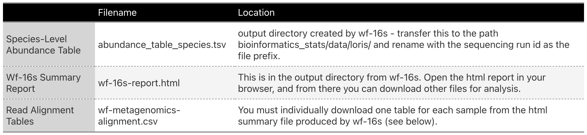

```{r setup, include=FALSE}
library(conflicted)
library(tidyverse)
library(bslib)
library(htmltools)
library(microeco)
library(seqinr)
library(ape)
library(gtExtras)

source("setup/knit_engines.R")
source("setup/conflicted.R")
source("setup/default_inputs.R")
source("setup/config_paths.R")

```

# Intro

## This Workflow

This is the current recommended pipeline for processing **full-length 16S reads and count data** generated from the EPI2ME Labs wf-16s workflow.  

## Some Background

Microbiome data analysis has rapidly evolved into a cornerstone of biological and ecological research, offering insights into how microbial communities influence everything from human health to environmental ecosystems. However, this type of analysis often involves multiple complex steps: data normalization, diversity calculations, community composition comparisons, and advanced visualizations.  

>For more information on some of the statistical tests I often use/recommend, see the tutorial in this directory called [Data_Notes](https://rich-molecular-health-lab.github.io/bioinformatics_stats/Data_Notes.html).

## MicroEco

The [microeco R package](https://chiliubio.github.io/microeco_tutorial/) provides an elegant and comprehensive solution by integrating many of the most current and popular microbiome analysis approaches into a unified framework. This package simplifies workflows, making it easy to prepare datasets, calculate metrics, and create publication-quality visualizations. Importantly, microeco is designed to work seamlessly with ggplot2 and other widely used R packages, offering flexibility for customization and compatibility with established workflows. If you click the link above, you will find a very comprehensive tutorial presenting the full array of analysis options.  

In this workflow, we will prepare our datasets for use with microeco, ensuring that our data is clean, structured, and ready for downstream analyses such as diversity calculations, community comparisons, and informative visualizations.  

### First Use

MicroEco installation can be a bit tricky the first time, simply because of the number of dependencies. I created a [separate markdown file to walk you through the packages you will need](https://rich-molecular-health-lab.github.io/workflows_first_use/microeco_first_use.html), but the tutorial on [MicroEco's page does an even better job of explaining things](https://chiliubio.github.io/microeco_tutorial/intro.html#dependence). If this is your first time on this workflow, I recommend you start with that, ensure all packages have been installed, and then proceed with this.  

## The Data Used Here

I am writing this script with a version of our lab's pygmy loris microbiome data. If you are working on one of our other microbiome projects, it should be fairly simple to adapt the original .Rmd script you are reading to a different dataset, especially if you make use of the params settings in the yaml header at the top.

### Previous Scripts

You should have already completed the [SampleInventory](https://rich-molecular-health-lab.github.io/read_processing/SampleInventory.html) and [MetadataSetup](https://rich-molecular-health-lab.github.io/bioinformatics_stats/MetadataSetup.html) workflows, which prepared formatted files that you can import here to begin connecting your outcome metrics to your independent variables.  

---

# Workflow

## Load Data

```{r}
source("metadata/loris/factors.R")
metadata <- read_tsv("metadata/loris/samples_metadata.tsv", show_col_types = FALSE)  %>%
  filter(steps_remaining == "sample extracted and sequenced") %>%
  filter(!is.na(collection_date)) %>%
  mutate(across(ends_with("date"), ~ymd(.)))

metadata
```

### Ordered Sample Lists for Subsetting

```{r}
sample.list <- metadata %>% 
               distinct(identifier, subject, collection_date) %>%
               filter(subject != "unknown") %>%
               arrange(subject, collection_date) %>%
               distinct(identifier) %>%
                   map(\(x) as.list(x)) %>%
  list_flatten(name_spec = "")

samples <- sample.list %>% unlist()

samp.list.culi  <- metadata %>% 
                   filter(subject == "culi") %>%
                   distinct(identifier, collection_date) %>%
                   arrange(collection_date) %>%
                   distinct(identifier) %>%
                   map(\(x) as.list(x)) %>%
  list_flatten(name_spec = "")

samples.culi       <- samp.list.culi %>% unlist()


samp.list.warb  <- metadata %>% 
                   filter(subject == "warble") %>%
                   distinct(identifier, collection_date) %>%
                   arrange(collection_date) %>%
                   distinct(identifier) %>%
                   map(\(x) as.list(x)) %>%
  list_flatten(name_spec = "")

samples.warb <- samp.list.warb %>% unlist()

libraries <- metadata %>%
  arrange(seq_run_date) %>%
  select(library_id, identifier) %>%
  group_by(library_id) %>%
  group_map(~ {
    setNames(list(as.list(.x$identifier)), .y$library_id)
  }, .keep = TRUE) %>%
  flatten()

working_libraries <- libraries %>%
  keep_at(paste0(params$seqrun)) %>%
  list_c()
```

## Wf-16S Outputs

You will need the following files from the output directory generated by running wf-16s at the end of the ReadProcessing script:



### Species-Level Abundance Table

We are going to read all current versions of abundance tables produced by wf-16s and bind them into a single table. We really just want to use this to inventory the names and other data for every sample according to the wf-16s syntax though. We will calculate abundances on our own after we clean, filter, and manipulate the data a bit more.  

For this step, make sure you have all abundance tables and only your abundance files in the subdirectory path identified in your config.yml file. They should also be named beginning with the sequencing run id or library_id followed by "_abundance_table_species.tsv".  

```{r}
abundance <- map(seqruns, ~ {
  seqrun <- .x
  path   <- abund_wf16s_files[[paste0(seqrun)]]
  
  df <- read_tsv(path) %>%
        rename_with(~str_replace_all(., "\\.", "-")) %>%
        select(-c(starts_with("total"))) %>%
        mutate(across(where(is.character), ~str_squish(str_remove_all(., "'|\\[|\\]"))))
  
  df.list <- list(df) %>% set_names(seqrun)
  
  return(df.list)
}) %>% list_flatten(name_spec = "{inner}")

seqids <- imap(abundance, ~ {
  seqrun   <- .y
  df       <- .x
  seqids   <- names(select(df, -tax))

  
  as.list(seqids)
  
})


```

### Read Alignment Tables

This step is pretty annoying, but until the developers update this gap I use the following workaround to import the raw alignment data for each sample and process it directly here in R.  

First, we will use the list of IDs that we just generated from the abundance tables and the metadata table as well as the seqrun id from the yaml header to create a table for renaming the csv files we download from the Wf-16S Report.  

#### Generate Filenames

```{r}
filenames <- seqids %>% 
             keep_at(params$seqrun) %>% 
             unlist() %>%
             enframe() %>%
             select(alias = value) %>%
  mutate(file_append = (row_number() - 1)) %>%
  mutate(old_name    = if_else(file_append == 0,
                               "wf-metagenomics-alignment.csv",
                      str_glue("wf-metagenomics-alignment (",
                               "{file_append}", ").csv")),
         new_name    = str_glue("{alias}",
                                "_wf-metagenomics-alignment.csv"), 
                                .keep = "none")

write.table(filenames,  "tmp/tmp_table.tsv",
              sep       = "\t",
              quote     = FALSE,
              row.names = FALSE,
              col.names = FALSE)
```


#### Download all Individual Alignment Tables

Now comes the somewhat messy workaround...

1. Make sure you have a completely clean temporary directory available for downloading.
  - I generally just empty out my Downloads folder each time before I do this and download to there first.
2. Go to the html workflow report in your browser window and scroll down to the **Alignment Statistics** section. 
  - Click ***Export CSV***. Then use the dropdown box to select the next sample and repeat the *Export CSV* process. 
  - Keep doing this for all 24 samples from your multiplexed run.
  - This part is important: **You must be sure to download each table sequentially in the order it appears in the dropdown.**
    - The code chunk that I wrote below uses an ordered list of those sample IDs to rename the files in your downloads folder based on the order in which you downloaded them (e.g., *wf-metagenomics-alignment (2).csv* and *wf-metagenomics-alignment (3).csv* may become *hdz-489-s391_wf-metagenomics-alignment.csv* and *hdz-488-s390_wf-metagenomics-alignment.csv*).
3. Manually transfer all your newly downloaded **but not yet renamed** files to the following sub directory (found at global$tmp_downloads in my config.yml):
  - "../bioinformatics_stats/tmp/downloads/"
  - **NOTE: MAKE SURE THIS FOLDER IS EMPTY FIRST**
3.  **Only after you have downloaded all 24 csv files and transferred them to that directory:** Run the code below from the Terminal tab. 
  
#### Rename and Transfer Files from the Local Terminal

>Again, only do this after you have those 24 new csv files in the tmp_downloads directory beginning in *wf-metagenomics-alignment* and you have the filename table we created above sitting in the tmp_lists directory.
  - The code will simultaneously rename all 24 files and transfer them to the subdirectory path$read_alignments.
  - The rest of the script below uses this filename system to import and merge the files, matching every aligned read to its sequence_id
  - If it worked, then all the files should disappear from the temp directory and you should see 24 new csv files in your data directory ending in *wf-metagenomics-alignment.csv*

```{terminal, warning = FALSE, echo = FALSE}

filenames="../tmp_table.tsv"
target_dir="../../path$read_alignments"
downloads="global$tmp_downloads"

cd $downloads

while IFS=$'\t' read -r old_name new_name; do
    mv "$old_name" "$target_dir/$new_name"
done < "$filenames"

```

#### Read All Files In

Now we will go ahead and read in those new tables as well as any others to update one comprehensive dataframe with all read alignments for this dataset to date. This code assumes that you have all properly named and structured alignment tables in a single subdirectory together and makes use of the config file's path to that subdirectory.  

```{r, warning = FALSE}
alignment.files.list <- list.files(path       = path$read_alignments, 
                                   pattern    = "*_wf-metagenomics-alignment.csv$", 
                                   full.names = TRUE)
alignment.filenames  <- list.files(path       = path$read_alignments, 
                                   pattern    = "*_wf-metagenomics-alignment.csv$", 
                                   full.names = FALSE)
alignment.files      <- lapply(alignment.files.list, read_csv)
alias                <- str_remove(alignment.filenames, "_wf-metagenomics-alignment.csv")

alignment.files <- Map(function(df, id) {
  if (nrow(df) > 0) {
    df$alias <- id
  } else {
    warning(paste("Data frame for", id, "is empty. Alias not assigned."))
  }
  return(df)
}, alignment.files, alias)
```
  
>In the next step, note that I filter the reads based on the minimum coverage value for the methods_16s records in my config file. This is an example of how using the config file helps us avoid any discrepancies in our parameters over the course of the study and gives us a centralized location to update those parameters or compile them for our reporting/publications at any time.  

```{r, message = FALSE, warning = FALSE}
alignments.long     <- bind_rows(alignment.files) %>%
                        as_tibble()  %>%
  rename_with(~str_replace_all(., "\\s", "_")) %>%
  mutate(across(where(is.character), ~str_squish(str_remove_all(., "'|\\[|\\]")))) %>% 
                        select(ref,
                               taxid,
                               species,
                               genus,
                               family,
                               order,
                               class,
                               phylum,
                               superkingdom,
                               identifier = alias,
                               coverage,
                               n_reads = number_of_reads)    %>%
                        left_join(select(metadata, identifier), 
                                  by = join_by(identifier)) %>%
                        filter(coverage >= methods_16s$min_cov & !is.na(identifier)) %>%
                        group_by(ref,
                                 taxid,
                                 species,
                                 genus,
                                 family,
                                 order,
                                 class,
                                 phylum,
                                 superkingdom,
                                 identifier) %>%
                        summarize(samp_cov     = mean(coverage),
                                  samp_n_reads = mean(n_reads)) %>% ungroup() %>%
                        mutate(identifier = factor(identifier, levels = unique(samples))) %>%
                        arrange(identifier) %>%
                        arrange(superkingdom,
                                phylum,
                                class,
                                order,
                                family,
                                genus,
                                species)
```

Next, we will simplify this into a table with just one row per reference represented in our dataset. This will be important for fetching representative fasta files from GenBank a few steps below.  

```{r, warning = FALSE, message = FALSE}
alignments.refs <- alignments.long %>% 
                        group_by(ref,
                                 taxid,
                                 species,
                                 genus,
                                 family,
                                 order,
                                 class,
                                 phylum,
                                 superkingdom) %>%
                        summarize(ref_n_reads   = round(sum(samp_n_reads),  digits = 2),
                                  ref_mean_cov  = round(mean(samp_cov),     digits = 2)) %>%
                        ungroup() %>% group_by(species,
                                               genus,
                                               family,
                                               order,
                                               class,
                                               phylum,
                                               superkingdom) %>%
                        arrange(species, desc(ref_n_reads), desc(ref_mean_cov)) %>%
                        mutate(ref_order       = row_number(),
                               tax_total_count = sum(ref_n_reads)) %>%
                        ungroup() %>%
                        filter(ref_order == 1) %>%
                        select(-ref_order)  %>%
                        arrange(superkingdom,
                                phylum,
                                class,
                                order,
                                family,
                                genus,
                                species)
```
  
Now, we will take the original long table and wrangle it into a structure that we can use for calculating relative abundances after we do some further quality control and normalization on the data.  

```{r, warning = FALSE, message = FALSE}
alignments    <- alignments.long %>% 
                        group_by(superkingdom,
                                 phylum,
                                 class,
                                 order,
                                 family,
                                 genus,
                                 species,
                                 identifier) %>%
                          summarize(counts = sum(samp_n_reads)) %>%
                          ungroup() %>%
                          left_join(alignments.refs,
                    by = join_by(superkingdom,
                                 phylum,
                                 class,
                                 order,
                                 family,
                                 genus,
                                 species)) %>%
                    pivot_wider(names_from  = identifier,
                                values_from = counts,
                                values_fill = 0) %>%
                        arrange(superkingdom,
                                phylum,
                                class,
                                order,
                                family,
                                genus,
                                species) %>%
                    mutate(organism = as.character(str_glue("txid", "{taxid}"))) 

write_tsv(alignments, "microeco/loris/alignments.tsv")

```

# Data Check

It is a good idea to look at our read counts across our dataset at this point so we can decide how best to normalize our data later.

```{r}
depth <- alignments.long %>%
  filter(!is.na(identifier)) %>%
  select(identifier,
         samp_cov,
         samp_n_reads) %>%
  group_by(identifier) %>%
  summarize(depth         = round(sum(samp_n_reads), digits = 0),
            mean_coverage = round(mean(samp_cov), digits = 2)) %>%
  mutate(mean_coverage = mean_coverage/100) %>%
  ungroup() %>%
  left_join(metadata, by = join_by(identifier)) %>%
  distinct()

write_csv(depth, "data/loris/loris_seq_depth_16s.csv")
```

---

# Update References and Fetch Representative Sequences

Some of the standard microbiome profiling metrics rely on on an OTU approach developed for the more traditional short-read sequences produced by Illumina and other nextgen platforms. Constructing representative sequences for each OTU enables phylogenetic analyses that can be particularly useful in visualizations.  
  
ONT Reads are generally still too messy and long to smoothly produce consensus sequences for each taxon. I use a workaround to enable us to still generate some phylogenetic estimates and graphics, though we will really be visualizing the relationships between the reference sequences for each taxon that our reads align to. The first step of this will use Entrez Direct to source a reference fasta for each of the taxids from our minimap2 results.  

## Check Previous Taxonomy List

Because we do not sequence and profile all our data for a project at once, we need a system for reading in, updating, and exporting our taxonomy records. This is also a helpful approach, because as we notice fewer and fewer new taxa appearing in our subsequent sequencing runs, we can assume we are reaching an optimal sample size. First, we will read in our ongoing taxonomy list for this sampleset.

```{r, message = FALSE, eval=FALSE}
rep.seqs.previous <- read.fasta(path$taxa_reps$aligned)

rep.seqs.txids    <- tibble(getName(rep.seqs.previous)) %>% 
  mutate(organism  =        getName(rep.seqs.previous)) %>% 
  mutate(taxid     = as.numeric(str_remove_all(organism, "[^\\d]"))) %>%
  select(taxid)

new.refs          <- alignments %>% anti_join(rep.seqs.txids) %>% 
                     select(ref, organism) %>% distinct()


  write.table(new.refs,
              global$tmp_fetch,
              sep       = "\t",
              quote     = FALSE,
              row.names = FALSE,
              col.names = FALSE)
```

Transfer the fetch_references.txt file from the local tmp directory to the proper directory on Swan and then run the script below.

## Fetch New References Using Entrez Direct

Now you need to switch to the terminal and log into the HCC. We will use the entrez-direct package to interface with NCBI's databases adn fetch our reference sequences. If you have not used the HCC before, then refer to the [MinIONReadProcessing](https://rich-molecular-health-lab.github.io/read_processing/MinIONReadProcessing.html) script for more details.

### Batch Script Header

```{terminal, warning = FALSE, echo = FALSE}
#!/bin/bash
#SBATCH --time=1:00:00
#SBATCH --job-name=fetch_refs_params$seqrun
#SBATCH --error=swan$logs/fetch_refs_params$seqrun_%A_%a.err
#SBATCH --output=swan$logs/fetch_refs_params$seqrun_%A_%a.out
#SBATCH --nodes=1
#SBATCH --ntasks-per-node=1
#SBATCH --mem=100GB
#SBATCH --partition=guest
```

### Open Interactive Job

```{terminal, warning = FALSE, echo = FALSE, echo = FALSE}
srun --partition=guest --time=1:00:00 --nodes=1 --ntasks=1 --mem=100GB --job-name=fetch_refs_params$seqrun --pty $SHELL
```

### Code to Use

```{terminal, warning = FALSE, echo = FALSE}
module purge
module load entrez-direct
module load seqkit 

uid_file="swan$uid_file"
accessions_file="swan$accessions"
fasta_file="swan$tmp_fasta1"
renamed_fasta="swan$tmp_fasta2"
fasta_out="swan$tmp_fasta3"


> "$fasta_file"

cut -f1 "$uid_file" > "$accessions_file"

if efetch -db nuccore -input "$accessions_file" -format fasta -email params$email > "$fasta_file"; then
    echo "Sequences fetched successfully."
else
    echo "Error fetching sequences." >&2
    exit 1
fi

seqkit replace $fasta_file -p '^(\S+)(.+?)$' -r '{kv}$2' -k $uid_file -o $renamed_fasta

rm $fasta_file
mv $renamed_fasta $fasta_out

```

### Submit Batch Script

```{terminal, warning = FALSE, echo = FALSE}
cd swan$scripts
sbatch fetch_refs_params$seqrun.sh
```

Once the script finishes running, transfer the tmp3.fasta file from the "tmp" directory on Swan to the local matching directory to run the next step in R.


## Join New References to Old FASTA

```{r, eval=F}
new.refseqs    <- read.fasta(paste0(global$tmp_fasta3))
merged.refseqs <- c(new.refseqs, rep.seqs.previous)

write.fasta(sequences =       merged.refseqs,
            names     = names(merged.refseqs),
            file.out  = global$tmp_fasta4)
```
  
  
Transfer this fasta file from your local "tmp" directory over to the matching directory on Swan and then run the script below.

## Realign Sequences and Assemble Updated Tree

### Batch Script Header

```{terminal, warning = FALSE, echo = FALSE}
#!/bin/bash
#SBATCH --time=3:00:00
#SBATCH --job-name=align_tree_params$seqrun
#SBATCH --error=swan$logs/align_tree_params$seqrun_%A_%a.err
#SBATCH --output=swan$logs/align_tree_params$seqrun_%A_%a.out
#SBATCH --nodes=1
#SBATCH --ntasks-per-node=1
#SBATCH --mem=250GB
#SBATCH --partition=guest
```

### Open Interactive Job

```{terminal, warning = FALSE, echo = FALSE}
srun --partition=guest --time=3:00:00 --nodes=1 --ntasks=1 --mem=250GB --job-name=align_tree_params$seqrun --pty $SHELL
```

### Code to Use

```{terminal, warning = FALSE, echo = FALSE}
module purge
module load mafft 
module load fasttree 

input_fasta="swan$tmp_fasta4"
aligned_fasta="swan$loris_mb_aligned"
tree_file="swan$loris_mb_tree"

mafft --auto $input_fasta > $aligned_fasta

FastTree -nt $aligned_fasta > $tree_file

```

### Submit Batch Script

```{terminal, warning = FALSE, echo = FALSE}
sbatch align_tree_params$seqrun.sh
```

Wait for the script to finish running and then transfer the final fasta and tree files from the directory on Swan to your local matching directory.

---

# Prepare MicroEco Datasets

MicroEco requires the following files to compile a dataset:

1.  **OTU Table**
  - TaxID as the rownames
  - Sample identifier as the column names
  
2.  **Taxonomy Table**
  - TaxID as the rownames
  - Taxonomic levels as the column names
  
The following files are optional inputs for the dataset:

1.  **Sample Table**
  - Sample identifier as the rownames
  - Metadata variables as the column names
  
2.  **Phylogenetic Tree**
  - Tree built from representative sequences and read in using read.tree from ape package
  
3.  **Representative Fasta**
  - Fasta with one representative sequence for every row in the Taxonomy table.
  
We will prepare each of these objects to compile our datasets.

## Phylogenetic Tree and Representative Fasta

Formatting within the Representative Fasta can be pretty tricky for some applications once we work with different microeco fucntions. In particular, the Tax4Fun algorithm seems to work better with a slightly different syntax in the files, so I will create different versions that eventually build mirror datasets to use depending on the application.


```{r}
tax.tree         <- read.tree(path$taxa_reps$tree)
rep.seqs         <- read.fasta(path$taxa_reps$aligned)
rep.seqs.tax4fun <- lapply(rep.seqs, function(seq) {gsub("-", "", seq)})

write.fasta(
  sequences = rep.seqs.tax4fun,
  names     = names(rep.seqs.tax4fun),
  file.out  = "microeco/loris/representative_seqs_tax4fun.fasta"
)
write.fasta(
  sequences = rep.seqs,
  names     = names(rep.seqs),
  file.out  = "microeco/loris/representative_seqs.fasta"
)

write.tree(
  phy = tax.tree,
  file = "microeco/loris/tree.newick"
)
```

## Taxonomy Table

```{r}
tax.table <- alignments %>% 
             column_to_rownames("organism") %>%
             select(superkingdom,
                     phylum,
                     class,
                     order,
                     family,
                     genus,
                     species) %>%
             arrange(superkingdom,
                     phylum,
                     class,
                     order,
                     family,
                     genus,
                     species) %>%
             rename_with(~str_to_title(.)) %>%
             rename(Kingdom = Superkingdom) %>%
             relocate(Kingdom) %>%
             distinct() %>%
             tidy_taxonomy()

tax.table %>%
  rownames_to_column("organism") %>%
  write_tsv("microeco/loris/taxonomy_table.tsv")


tax.table
```

Now we need to update our working taxonomy file for future updates after sequencing runs, so I will also write a version of this to a tsv file.

```{r}
taxonomy.list <- alignments %>% 
                 select(organism, 
                        superkingdom,
                        phylum,
                        class,
                        order,
                        family,
                        genus,
                        species) %>% 
             arrange(superkingdom,
                     phylum,
                     class,
                     order,
                     family,
                     genus,
                     species) %>%
                 rename_with(~str_to_title(.)) %>%
             rename(Kingdom = Superkingdom) %>%
                 relocate(Organism, Kingdom)

write_tsv(taxonomy.list, path$taxa_reps$table)

taxonomy.list
```

## OTU Table

```{r}
otu.table <- alignments %>% 
          select(organism,
                 any_of(samples)) %>%
                 column_to_rownames("organism")

otu.sample.list <- as.list(names(otu.table))


otu.table %>%
  rownames_to_column("organism") %>%
write_tsv("microeco/loris/otu_table.tsv")

otu.table
```

### Check Workflow

This is also a good point to check for discrepencies in tables to see whether any data have been erroneously excluded or to notice any patterns in excluded samples. I will also check the metadata table for any duplicated sample_ids, as this will give us problems in the next step.

```{r}
samples.filtered <- setdiff(sample.list, otu.sample.list)

excluded <- metadata %>% filter(sample_id %in% samples.filtered)

excluded
```


```{r, message = F}
samples.duplicated <- metadata %>% 
                filter(identifier %in% otu.sample.list) %>%
  select(-c(
    starts_with("seq_run"),
    starts_with("extract"),
    starts_with("library"),
    ends_with("_id")
    )) %>%
                distinct() %>%
                      group_by(identifier) %>%
                      summarize(count = n()) %>%
                      filter(count > 1) %>%
                      left_join(metadata)

samples.duplicated
```

## Sample Table

Now I am going to refine the metadata table to include the versions of each variable that I may want to include in my downstream analyses.  

Most importantly, I need to update my metadata table so that I have **one row per column in the OTU table.**

```{r}
sample.table <- metadata  %>% 
                filter(identifier %in% otu.sample.list) %>%
                arrange(collection_day, subject) %>%
  select(
 identifier,    
 starts_with("subject"),
 starts_with("collection"),
 starts_with("environment"),
 starts_with("repro"),
 starts_with("bristol"),
 starts_with("supplement"),
 starts_with("diet")       
  ) %>%
                column_to_rownames("identifier")

sample.table %>%
  rownames_to_column("identifier") %>%
  write_tsv("microeco/loris/sample_table.tsv")  

sample.table
```

# Next Steps

Now you have the following files ready for use in one of the data analysis workflows using the `microeco` package:

1.  Sample Table
2.  OTU Table
3.  Taxonomy Table
4.  Phylogenetic Tree
5.  FASTA with Genbank Reference Sequences for each row in the Taxonomy Table

You should proceed with further data normalizing before generating inferential statistics or visualizing (e.g., rarefaction, relative abundances, alpha diversity, etc.)

